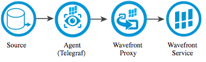
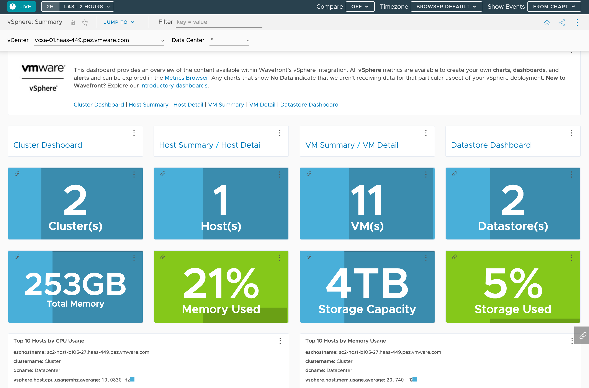
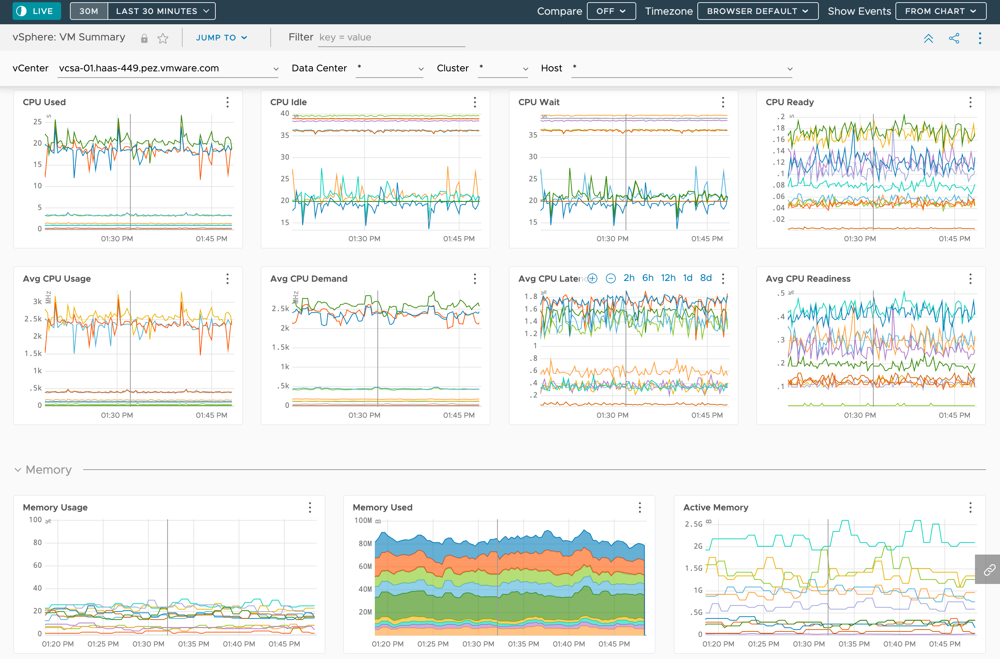
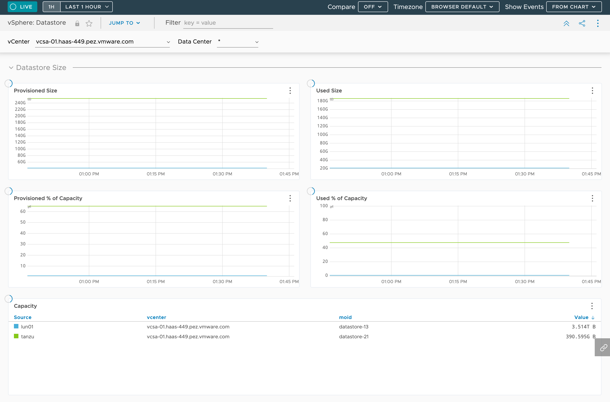

# Observing vSphere with Tanzu Observability and Telegraf running as a Kubernetes pod

This project allows you to observe your vSphere instance with
[Tanzu Observability](https://tanzu.vmware.com/observability)
(formely Wavefront), leveraging a
[Telegraf](https://github.com/influxdata/telegraf)
agent running as a Kubernetes pod.

The Telegraf agent is responsible for scraping metrics out of your vSphere instance,
and the Tanzu Observability proxy would then upload those metrics.



## How to use it?

First, you need to deploy the Tanzu Observability proxy agent to your Kubernetes cluster.

You may use [those instructions](https://docs.wavefront.com/kubernetes.html)
to deploy this agent, or just run this command:

```bash
$ kubectl create ns wavefront && helm install wavefront wavefront/wavefront \
  --set wavefront.url=https://MY_INSTANCE.wavefront.com \
  --set wavefront.token=MY_TOKEN \
  --set clusterName=MY_CLUSTER \
  --set collector.tags.environment=MY_ENV \
  --namespace wavefront
```

The default Telegraf configuration relies on a Wavefront proxy deployed in namespace `wavefront`.
You may have to adjust the
[Wavefront output configuration file](telegraf.d/wavefront.conf) accordingly.

You may want to tweak the file `telegraf.conf` to add custom tags to vSphere metrics:

```ini
[global_tags]
  environment = "MY_ENV"
```

Next you need to create the vSphere input configuration file.

Copy file `telegraf.d/vsphere.conf.sample` to `telegraf.d/vsphere.conf`.
This file provides a default configuration to scrape metrics out of your vSphere instance.

Edit this file, and set your vSphere credentials:

```ini
[[inputs.vsphere]]
  ## List of vCenter URLs to be monitored.
  vcenters = [ "https://vcsa.mydomain.com" ]
  username = "administrator@vsphere.local"
  password = "changeme"
```

At this point, you're done with configuration files: let's move on to deployment!

Telegraf is about to be deployed to your cluster as a Kubernetes pod.
This pod will read its configuration from a `ConfigMap` instance,
and a `Secret` instance containing sensitive data (including your vSphere credentials).

In order to streamline the deployment of Telegraf and its configuration,
the [kustomize](https://kustomize.io) CLI is used.

Run this command to generate the deployment manifests and deploy to your cluster:

```bash
$ kustomize build . | kubectl apply -f -
```

A Telegraf agent is deployed in the namespace `telegraf`.
You may run the same command again after you update the configuration files:
a new Telegraf agent instance will be deployed with the new configuration.

Provided the configuration is correct, you should be able to use
Tanzu Observability right away to monitor your vSphere instance.

Enjoy!







## Contribute

Contributions are always welcome!

Feel free to open issues & send PR.

## License

Copyright &copy; 2021 [VMware, Inc. or its affiliates](https://vmware.com).

This project is licensed under the [Apache Software License version 2.0](https://www.apache.org/licenses/LICENSE-2.0).
